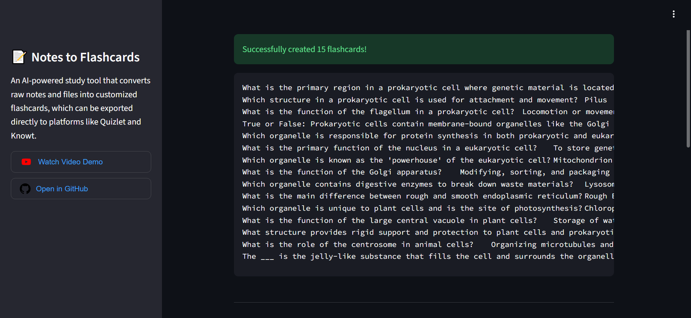

# Notes to Flashcards


An AI-powered study tool that converts raw notes and files into customized flashcards, which can be exported directly to platforms like Quizlet and Knowt.

[](https://notes-to-flashcards-generator.streamlit.app/)

---

## A Look Inside


---

## Video Demo
[](https://youtu.be/O4EYNBXZeUk)

---

## Features
* **Import Your Notes:** Upload up to 3 TXT, PDF, or DOCX files at once. The app extracts all the information, text, and images.
* **Flashcard Modes:** Customize the output style (Terms & Definitions, Practice Test, Fill-in-the-Blank) and control the number of cards generated, or let the AI decide.
* **Deck Expansions:** Need more cards? Continuously generate new flashcards with the click of a button.
* **Exporting:** Instantly generate flashcard sets in different formats, ready to import into Quizlet, Knowt, and other study platforms.

## Tech Stack
* **Frontend:** ``Streamlit``
* **AI Model:** ``Google Gemini 3.1 Flash Lite``
* **Data Validation:** ``Pydantic``
* **Document Parsing:** ``pypdf`` and ``python-docx``

---

## Run it Locally

1. Clone the repository
    ```
    git clone https://github.com/git-ishaan-kumar/notes-to-flashcards.git
    ```

2. Install the required dependencies
    ```
    pip install -r requirements.txt
    ```

3. Setup your API key by creating a ``.env`` file in the root directory and adding your Google Gemini API key
    ```
    GEMINI_API_KEY="your_api_key_here"
    ```

4. Run the Streamlit app
    ```
    streamlit run app.py
    ```